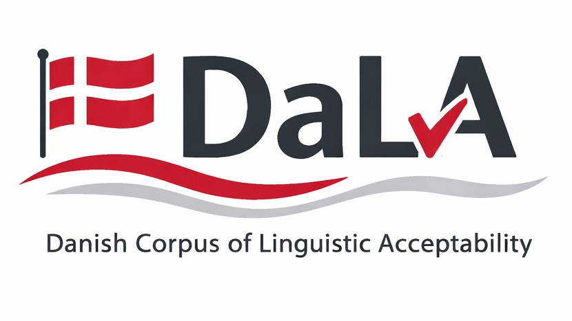

# DaLA: Danish Linguistic Acceptability Evaluation Guided by Real World Errors

<p align="center">
  
</p>

## Overview
This repository contains the source code for creating the Danish Corpus of Linguistic Acceptability (DaLA). Related paper: [DaLA: Danish Linguistic Acceptability Evaluation Guided by Real World Errors](https://arxiv.org/abs/2512.04799).

The corpus is designed to evaluate linguistic acceptability in Danish. Part of this code matches or has been adapted from [EuroEval](https://aclanthology.org/2023.nodalida-1.20/) (Nielsen, 2023) in order for this dataset to be easily used via the [EuroEval evaluation framework](https://euroeval.com/). 

## Multilingual pipeline

DaLA builds from **language input packs**. Danish vocabulary, morphology rules,
rule priority, parser, dataset URLs, filtering and split settings are in
[`config/languages/da.json`](config/languages/da.json). English uses
[`config/languages/en.json`](config/languages/en.json), productive grammar rules
observed lexical spelling substitutions, screened character generators and guarded
word deletion/swapping. New languages can supply a pack
and an analysis adapter without copying dataset orchestration.

The [OKF 0.2 wiki](wiki/index.md) records architecture, evidence, reproduction,
equivalence and measured results. Danish compatibility mode preserves the
historical selection, splitting, reconstruction and random-number behavior;
provenance-preserving pair mode supplies document splits and instruction exports.

After installing `requirements.txt` and the parser named in your pack:

```bash
# Danish, preserving historical behavior:
python -m pip install https://github.com/explosion/spacy-models/releases/download/da_core_news_md-3.8.0/da_core_news_md-3.8.0-py3-none-any.whl
python -m dala.multilingual --profile config/languages/da.json --output-dir la_output/danish
python -m scripts.check_danish_equivalence

# English, with local LanguageTool screening:
python -m pip install https://github.com/explosion/spacy-models/releases/download/en_core_web_md-3.8.0/en_core_web_md-3.8.0-py3-none-any.whl
python -m dala.language_check --setup
python -m dala.multilingual --profile config/languages/en.json --output-dir la_output/english_productive
python -m dala.validate_dataset la_output/english_productive
```

For **DaLA English — Common Pile**, the `en_scale` pack expands the pinned
source pool and uses resumable, checksummed batches. See the
[scale runbook and quality findings](wiki/pages/english-scale.md). The expanded
corpus is checker-screened; agent review found source errors that the checker
missed, so it is not a human-validated benchmark.

Choose a fresh output directory when rebuilding pair datasets. The equivalent
Python API is `dala.pipeline.build(profile, **options)`, with a profile code or
loaded profile dictionary. `--language da/en` abbreviates the built-in packs.
The historical EWT prototype remains available with `--language en --source ewt`.

Pair exports include canonical source/corrupted records, balanced acceptability
CSV/JSONL, and TV2R-style acceptability and correction instruction JSONL. Correction
includes unchanged clean controls. Edit evidence, source provenance, licenses,
checker diagnostics and a review queue accompany the data. Up to two errors are
used by the English pack: at most one grammar edit plus independent spelling.
Token fallback is a single edit. Productive spelling requires the local checker
in both configured dialects; `--checker off` is rejected for the active rulebook.

Danish equivalence checks compare a frozen pre-refactor implementation against
real DDT inputs, including exact rows, CSV bytes and RNG state. Equivalence does
not establish linguistic quality. English outputs are **checker-screened**, with
human precision still unmeasured. See the [review runbook](wiki/pages/dataset-runbook.md).

Builds save locally. Publishing requires an explicit `--push-to-hub` and creates
private datasets; repositories are never deleted by the script.

## Citation

```
@inproceedings{barmina-etal-2026-dala,
  title = {DaLA: Danish Linguistic Acceptability Evaluation Guided by Real World Errors},
  author = {Barmina, Gianluca and Norman, Nathalie Carmen Hau and Schneider-Kamp, Peter and Poech, Lukas Galke},
  booktitle = {Proceedings of the Fifteenth Language Resources and Evaluation Conference (LREC 2026)},
  month = {May},
  year = {2026},
  pages = {4312--4326},
  address = {Palma, Mallorca, Spain},
  publisher = {European Language Resources Association (ELRA)},
  editor = {Piperidis, Stelios and Bel, Núria and van den Heuvel, Henk and Ide, Nancy and Krek, Simon and Toral, Antonio},
  doi = {10.63317/4kcbotaa3zgo},
}
```

[//]: # (```)

[//]: # (@inproceedings{)

[//]: # (barmina2026dala,)

[//]: # (title={DaLA: Danish Linguistic Acceptability Evaluation Guided by Real World Errors},)

[//]: # (author={Gianluca Barmina and Nathalie Hau Norman and Peter Schneider-Kamp and Lukas Galke Poech},)

[//]: # (booktitle={The Fifteenth biennial Language Resources and Evaluation Conference &#40;LREC&#41;},)

[//]: # (year={2026},)

[//]: # (url={https://openreview.net/forum?id=MPJ3oXtTZl})

[//]: # (})

[//]: # (```)

## Dataset(s)
The DaLA dataset and its variants are available on Hugging Face (in parentheses the number of sentences for train, validation and test splits):
- [DaLA](https://huggingface.co/datasets/giannor/dala) (1024, 256, 2048)
- [DaLA Medium](https://huggingface.co/datasets/giannor/dala_medium) (4952, 386, 2678)
- [DaLA Large](https://huggingface.co/datasets/giannor/dala_large) (6124, 384, 1148)

## Methodology
This method starts from existing original Danish sentences (from [Universal Dependencies Danish](https://github.com/UniversalDependencies/UD_Danish-DDT)) and corrupts them in various ways to create minimal pairs. For each sentence exactly one error is introduced, and the resulting sentence is labeled as either acceptable or unacceptable. This method can be easily extended to apply more than one error to a sentence, but in this first version we only apply one, as done by many previous works (e.g. BLiMP, ScaLA), in order to be comparable with them.

## Evaluation
The evaluation of the DaLA corpus aims to ensure that the corruptions injected make the sentences not acceptable. This is performed using an hybrid approach that combines human and automatic evaluation. The human evaluation is conducted by native Danish linguists who assess the acceptability of the sentences. The automatic evaluation uses a well performing [Danish industrial tool](https://www.writeassistant.com/) (similar to grammarly) openly available. First a set of sentences is evaluated by the tool, and then the sentences not flagged by the tool are evaluated by the linguists. The sentences flagged by the tool are considered acceptable, while those not flagged are considered unacceptable.

## Running the Code

We suggest using Python $\geq$ 3.12. You can install all the required packeges using the `requirements.txt` file:

```bash
pip install -r requirements.txt
```

### DaLA Dataset Creation

The DaLA creation script is located in `dala/create_dala.py` file. You can run it with the following command:

```bash
python dala/create_dala.py
```

At the top of the script, you can set some parameters for the dataset creation:

- `MIN_NUM_CHARS_IN_DOCUMENT`: Minimum number of characters in a sentence to be considered for the dataset.
- `MAX_NUM_CHARS_IN_DOCUMENT`: Maximum number of characters in a sentence to be considered for the dataset.
- `USE_SPLIT_PROPORTIONS`: If set to `True`, the dataset will be split into training, validation, and test sets with the proportions defined in
  - `TRAIN_PROPORTION`
  - `TEST_PROPORTION`
  - Validation set will be the remaining proportion.
  - If set to `False`, the dataset will be split according to original ScaLA proportions from EuroEval.
  - For DaLA Medium and DaLA Large, the proportions used (train, test) are respectively (0.6, 0.35) and (0.8, 0.15).
- Publishing is optional: pass `--push-to-hub your-account/dataset-name` and authenticate with Hugging Face first.

The script will also save the dataset locally in a directory named `la_output` in CSV format.

The different corruption functions are implemented and briefly documented in `dala/dala_corrupt.py`. There is one function for each type of corruption. We analyzed the corruption frequency for each error type in the dataset, and we fixed the order of the corruption functions application to ensure that each error is represented as best as possible in the dataset, considering the fact that some errors are intrinsically more frequent than others.


### Data Proportions
In `data_proportion.ipynb`, you can find the code that calculates the proportions of each type of corruption in the dataset for each split, prints it and plots it. To ensure that the different splits have similar proportions, we also use calculate difference distribution distance measures between the splits.


### DaLA Dataset Evaluation
The evaluation notebook (regarding the automatic evaluation part) is located in `evaluation/write_assistant_evaluation.ipynb`. The evaluation is done at error level, meaning that each error is evaluated separately on the whole original dataset (UD Danish). For each corrupted sentence, the [Write Assistant](https://www.writeassistant.com/) tool is used to check if the sentence is flagged as acceptable or not and we output:

- Number of corrupted sentences
- Number of sentences flagged as unacceptable (True Positives)
- Number of sentences flagged as acceptable (False Positives)
- Precision

We consider only precision because we are only interested in evaluating the corruption quality. This means that we consider and evaluate only the corrupted (positives) sentences.


### Models evaluation on DaLA
The model evaluation is not included in this repository as it is based on the original [EuroEval](https://euroeval.com/) evaluation framework. However, since this dataset matches the linguistic acceptability dataset format expected by EuroEval the process to replicate the evaluation is straightforward:

- Install [EuroEval](https://github.com/EuroEval/EuroEval)
- Go to EuroEval's folder in your virtual environment (e.g. miniconda3/envs/,your_env>/lib/python3.x/site-packages/euroeval/) 
- Go to `dataset_configs/danish.py`
- In `SCALA_DA_CONFIG` replace the `huggingface_id` value with the Hugging Face dataset ID you supplied with `--push-to-hub` (or `giannor/dala` (or one of the variants) to use the existing DaLA dataset on Hugging Face).
- After that you can run the evaluation using the EuroEval framework from the code as you would normally do, for example (for evaluating a model only on Danish linguistic acceptability):

```python
from euroeval import Benchmarker

hf_token = your_huggingface_token
model = huggingface_model_id_or_path
la_task = "linguistic-acceptability"

benchmark = Benchmarker(force=True)

benchmark(model=model, task=la_task, api_key=hf_token, verbose=True, raise_errors=True, language="da")
```

### Dutch: DynaWord pilot

For new production runs, use the uncapped **`nl_scale`** profile described below.
The commands in this pilot section reproduce the earlier frozen experiment.

The shared pipeline now supports Dutch with its own guarded grammatical rules,
spelling inventories, parser and checker configuration. The source is pinned
Dutch DynaWord government web text from `danish-foundation-models`; original
article URLs are unavailable in this subset. See the
[Dutch implementation and assessment](wiki/pages/dutch-dynaword.md).

```bash
python -m pip install https://github.com/explosion/spacy-models/releases/download/nl_core_news_md-3.8.0/nl_core_news_md-3.8.0-py3-none-any.whl
python -m scripts.prepare_dutch_resources
python -m dala.pair_pipeline --profile nl --max-documents 150 --max-errors 1 --output-dir la_output/dutch_dynaword_pilot_final
python -m dala.validate_dataset la_output/dutch_dynaword_pilot_final
```

The original pilot has 2,552 pairs (5,104 rows per task); a separate
`la_output/dutch_dynaword_agent_reviewed/` subset contains 108 explicitly
agent-accepted pairs. The final 100-pair sample had 91 clearly usable pairs,
seven source errors and two uncertain sources. Spelling comprises 97% of the
pilot, so broader grammar coverage and source curation are needed before scaling.
See the linked wiki report for frozen samples, judgments and limitations.

The pinned local LanguageTool checker also requires Java. Builds include
canonical pairs, balanced acceptability/correction task views, document-separated
splits and provenance. Automatic screening is not human linguistic validation.

The English release is available at
[schneiderkamplab/dala-english-common-pile](https://huggingface.co/datasets/schneiderkamplab/dala-english-common-pile)
with `acceptability` and `correction` configurations.


The expanded Dutch profile `nl_expanded` adds modern EUR-Lex, stricter government
selection, productive morphology and 50 fixed spellings. Prepare morphology with
`python -m scripts.prepare_dutch_morphology`, then build with
`python -m dala.pair_pipeline --profile nl_expanded --max-documents 200 --max-errors 1 --output-dir la_output/dutch_curated_expansion_pilot`.
The frozen expanded pilot has 1,448 pairs across nine families; 187/200 uniformly
sampled pairs were judged usable by agent inspection. It is not a gold dataset.
See [production readiness](wiki/pages/dutch-scale-readiness.md) for remaining
source-quality, article-concentration and capacity limits. `nl_scale_probe`
exercises the resumable builder on the same bounded sample.

The subsequent 1,000-document Dutch validation run produced 6,474 screened pairs.
The final `la_output/dutch_validation_curated/` subset has **2,312 pairs**
(4,624 rows per task), with spelling capped at 60% and article errors at 25% per
split. A fresh audit of the pre-removal balanced output found 188/200 usable
pairs; all intended errors were valid, but source defects remain a limitation.
The 13 flagged originals were removed from the final subset without treating
that removal as independent quality validation. D/dt and relative-pronoun
coverage remains one example each. See [larger validation results](wiki/pages/dutch-larger-validation.md)
for reproduction commands, frozen judgments and capacity estimates.


The current Dutch production profile is **`nl_scale`**. It processes all eligible
paragraphs and uses other grammar errors before article-number/article-gender
errors, with spelling as fallback. It applies no family-percentage downsampling.
All 46 audited source exclusions and the existing quality checks remain active.

```bash
python -m dala.pair_pipeline --profile nl_scale --max-errors 1 --offline --output-dir la_output/dutch_dynaword_uncapped
```

See [uncapped Dutch configuration](wiki/pages/dutch-uncapped.md) for verification
and the distinction from the earlier capped/balanced experiments.


European language pilots now use shared morphology and source pipelines with
separate language inputs. The current CPU pilots contain 30,897 pairs across
12 languages, covering 97/98 configured grammar-family combinations. Full-source
CPU inputs and resumable target profiles are prepared; native linguistic review
and release checks remain outstanding. See the [coverage preparation runbook](wiki/pages/european-coverage-preparation.md)
and [current selection](wiki/artifacts/european-expansion/current.json).

Full-size European candidate generation is running as `european_scale_v1` with
192 CPU parser workers total (16 per language), checkpointed and capped at
478,930 pairs per language. The [launch receipt](wiki/artifacts/european-expansion/european_scale_v1/launch.json) records profiles and process details.
